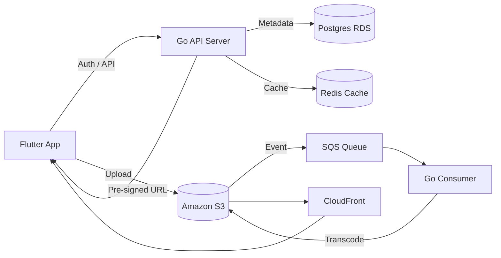

# System Architecture

## High-Level Architecture

## Architectural Principles

* Stateless API services
* Event-driven async processing
* Independent scaling of API and consumers
* CDN-first content delivery