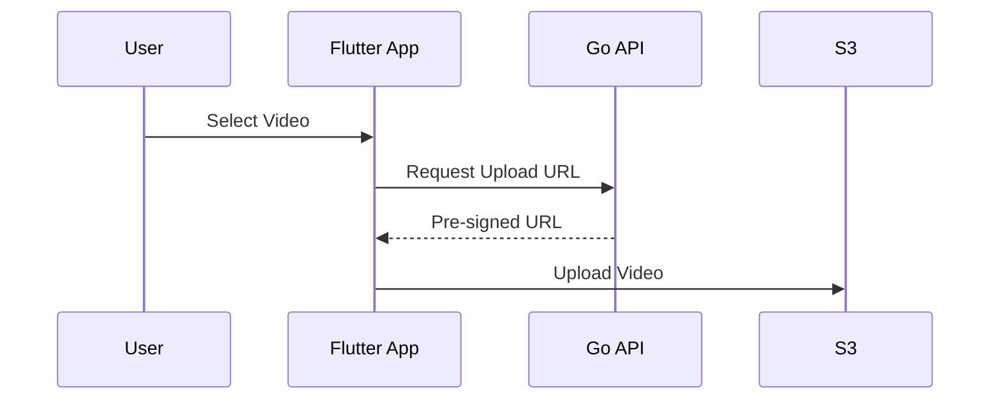

# Flutter

## Responsibilities

* User authentication
* Video upload initiation
* Adaptive playback

## Upload Flow

## Playback

* Uses HLS master playlist
* Player automatically switches bitrate based on network conditions