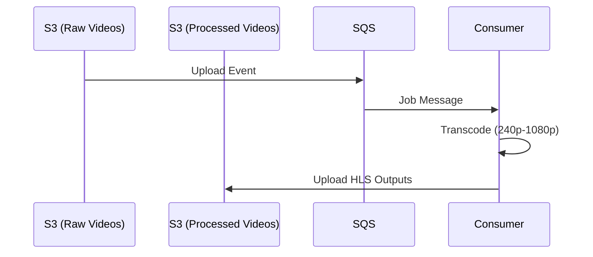

# Video Processing Pipeline

## Pipeline Overview

```mermaid
sequenceDiagram
    participant S3 as S3 (Raw Videos)
    participant S3-main as S3 (Processed Videos)
    participant Q as SQS
    participant C as Consumer

    S3->>Q: Upload Event
    Q->>C: Job Message
    C->>C: Transcode (240p-1080p)
    C->>S3-main: Upload HLS Outputs
```

## Transcoding Strategy

* Multiple renditions generated per video
* HLS-compatible playlists and segments
* Failure-safe retries via SQS